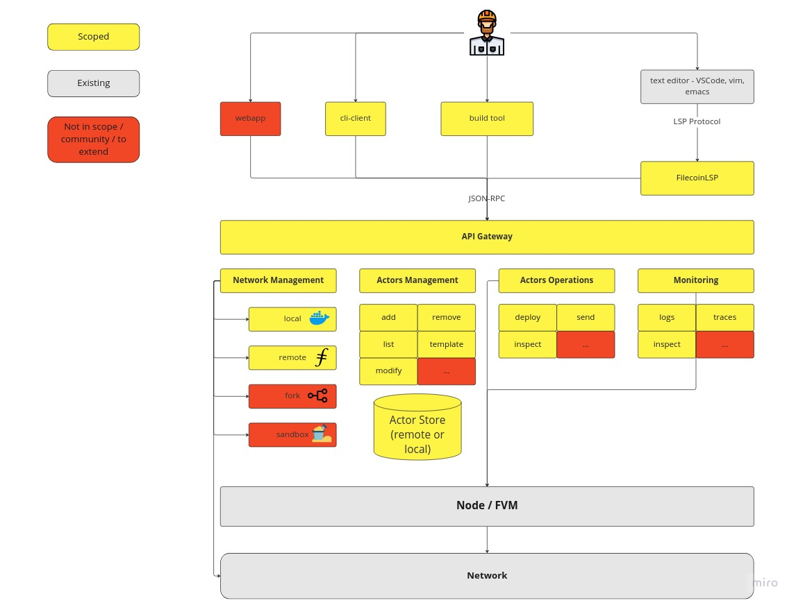

# filix

**Remix for Filecoin**

`filix` consists of a collection of tools developed by ChainSafe for use with
Filecoin and the Filecoin Virtual Machine. `filix` hopes to facilitate developers
who work with the Filecoin VM by providing:

1. A build tool that can:
    * compile an actor code to WASM in a ready-to-go
      bundle, with metadata to deploy to the backend;
    * provide scaffolding for a filecoin actor with readymade templates - (as a
      `cargo` plugin/extension); and,
    * Validate the created bundle.
2. Editor integration by means of hooking into the [Language Server
   Protocol](https://code.visualstudio.com/api/language-extensions/language-server-extension-guide)
   [code action
   requests](https://microsoft.github.io/language-server-protocol/specifications/lsp/3.17/specification/#textDocument_codeAction).
   This would facilitate:
    * Integration of most-valuable code action commands into a code editor;
    * Visualize gas traces as an overlay
    * Allow Rust developers to utilize their editor of choice as long as it
      supports the LSP.
3. A backend that works with the toolkit internals, the [*plumbing* to the
   porcelain](https://git-scm.com/book/en/v2/Git-Internals-Plumbing-and-Porcelain)
   for the front-end that follows so to speak. This will use OpenAPI
   specifications so as to be extensible later. This will consist of the
   following:
    * API Gateway - This is the entrypoint to the toolbox itself. This will:
        - Define an API using OpenAPI.
        - Generate server using the OpenAPI Spec.
    * Network Management Toolkit
        - Local
        - Remote
        - Fork
        - Sandbox
    * Actor Management Toolkit
        - Actor Operations
        - Monitoring
5. A front-end, by means of a *command-line-interface* that can:
    * Integrate with the backend API, composing available commands (using
      JSON-RPC) for high-level tasks.

## Architecture Diagram

*Architecture Diagram*

<!--
  TODO: Expand upon the usage, installation and link to other relevant pieces
  of documentation here. Figure out if we want to host a "filix book" in the
  vein of "forest book", but with all the architectural and development
  documentation.
-->

